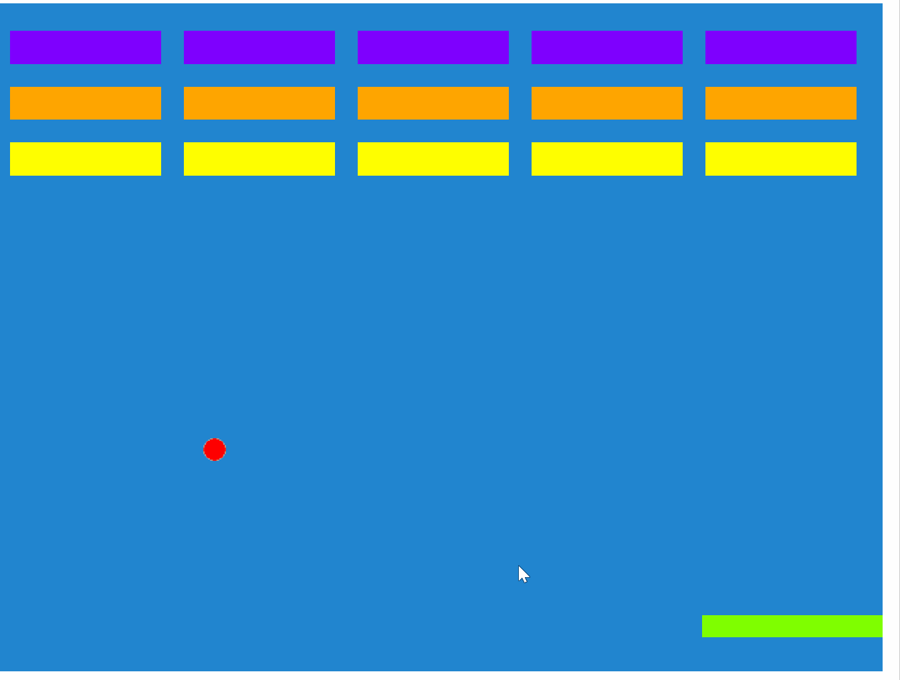

# Excalibur Breakout

Play example [here](https://excaliburjs.com/sample-breakout)

## Getting Started

1. [Generate a repository](https://github.com/excaliburjs/template-ts-parcel/generate) from this template
2. Modify the `package.json` with your own details
3. Run `npm install` to install dependencies
4. Run `npm start` to start the Parcel server!
5. Have fun!
